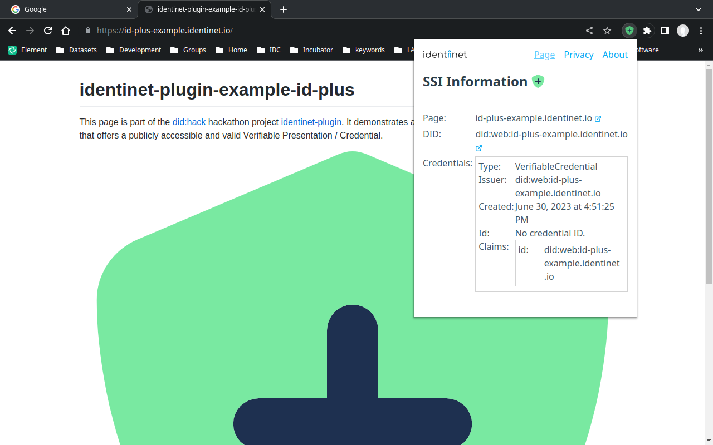
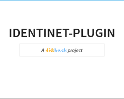
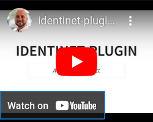
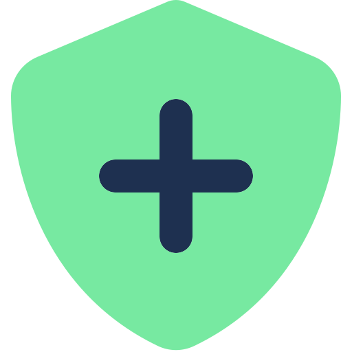
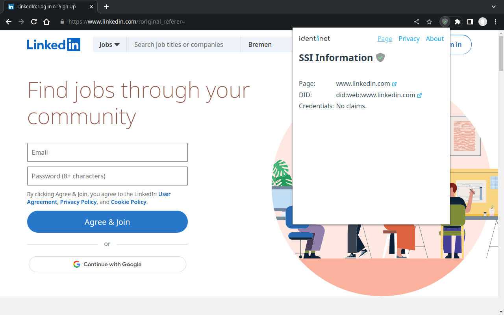

# identinet-plugin

[identinet](https://github.com/identinet/identinet-plugin) is a browser
extension that displays and verifies decentralized identity information of
websites. The extension is a [did:hack project](https://didhack.xyz/).

[](https://id-plus-example.identinet.io/)

## Presentation

<div style="display: flex; gap: 1em;">
  <div style="display: flex; flex-direction: column; align-items: center;">
    <a href="https://slidesdown.github.io/?slides=github.com/identinet/identinet-plugin"></a>
    <a href="https://slidesdown.github.io/?slides=github.com/identinet/identinet-plugin">Slideshow</a>
  </div>
  <div style="display: flex; flex-direction: column; align-items: center;">
    <a href="https://youtu.be/pXtc385wGfA"></a>
    <a href="https://youtu.be/pXtc385wGfA">did:hack presentation</a>
  </div>
</div>

## Installation

- Firefox:
  [https://addons.mozilla.org/en-US/firefox/addon/identinet/](https://addons.mozilla.org/en-US/firefox/addon/identinet/)

  Attention: after installing the add-on, it's currently necessary to grant the
  plugin access to websites. Firefox doesn't prompt the user during installation
  to grant these permissions.

  Navigate to Tools -> Add-ons and Themes. Select the identinet add-on and
  switch to the "Permissions" tab. Then grant the optional permission "Access
  your data for all websites".

- Chrome:
  [https://chrome.google.com/webstore/detail/identinet/hehmpjacggciaiknjpfkiecokomeeopm](https://chrome.google.com/webstore/detail/identinet/hehmpjacggciaiknjpfkiecokomeeopm)

## Usage

After installation, the extension is added to the list of extensions. Pin the
extension to the browser bar so that it is permanently visible.

The availability of a DID document and additional credentials for the website is
displayed with the following icons:

- 
  No DID document is available.
- 
  DID and credentials are available, the credentials have been successfully
  verified.
- 
  DID document incorrect or verification of credentials of failed.

Examples:

- 
  <a href="https://no-id-example.identinet.io/">https://no-id-example.identinet.io/</a>
- 
  <a href="https://id-example.identinet.io/">https://id-example.identinet.io/</a> - only a DID is avaible, no credentials.
- 
  <a href="https://id-plus-example.identinet.io/">https://id-plus-example.identinet.io/</a>
- 
  <a href="https://broken-example.identinet.io/">https://broken-example.identinet.io/</a>

## How it Works

The extension ..

1. displays the [W3C DID Document](https://w3c.github.io/did-core/) that is
   associated with the visited website, i.e. the DID `did:web:<domainname>`
   who's document is stored at `https://<domainname>/.well-known/did.json`.
2. retrieves, verifies, and displays a publicly stored
   [W3C Verifiable Presentation](https://www.w3.org/TR/vc-data-model-1.1/#presentations-0)
   that might contain multiple credentials. It's expected that DID
   `did:web:<domainname>` issued the presentation and that it's publicly
   available at `https://<domainname>/.well-known/presentation.json`.

## Create DID and Credentials for Domain

Requirements:

- [didkit CLI](https://www.spruceid.dev/didkit/didkit)
- Website that's hosted at a custom domain name, e.g. example.com
- `jq`

Create did:web DID and issue sample credential:

1. Generate a key: `didkit key generate ed25519 > key.jwk`
2. Generate a DID `did:web:<domainname>`:

```bash
DOMAINNAME="<your domainname>"
DID_WEB="did:web:${DOMAINNAME}"
KEY_ID=$(didkit key to did -k key.jwk | sed -ne 's/^did:key://p')
cat <<EOF | yq > did.json
{
  "@context": [
    "https://www.w3.org/ns/did/v1",
    "https://w3id.org/security/suites/ed25519-2020/v1",
    {
      "publicKeyJwk": {
        "@id": "https://w3id.org/security#publicKeyJwk",
        "@type": "@json"
      }
    }
  ],
  "id": "${DID_WEB}",
  "verificationMethod": [
    {
      "id": "${DID_WEB}#${KEY_ID}",
      "type": "Ed25519VerificationKey2020",
      "controller": "${DID_WEB}",
      "publicKeyJwk": $(yq e 'del(.d)' key.jwk)
    }
  ],
  "authentication": [
    "${DID_WEB}#${KEY_ID}"
  ],
  "assertionMethod": [
    "${DID_WEB}#${KEY_ID}"
  ]
}
EOF
```

3. Store and publish `did.json` in the web server's root directory at path
   `/.well-known/did.json`
4. Verify that the DID is publicly resolveable:
   `didkit did-resolve "${DID_WEB}"`
5. Issue sample credential:

```bash
cat > credential.json <<EOF
{
  "@context": ["https://www.w3.org/2018/credentials/v1", "https://w3id.org/security/suites/ed25519-2020/v1"],
  "type": ["VerifiableCredential"],
  "issuer": "${DID_WEB}",
  "issuanceDate": "$(date -u +"%Y-%m-%dT%H:%M:%SZ")",
  "credentialSubject": {
    "id": "${DID_WEB}"
  }
}
EOF

VERIFICATION_METHOD=$(jq -r '.assertionMethod[0]' < did.json)
didkit credential issue -t Ed25519Signature2020 -k key.jwk -p assertionMethod -v "${VERIFICATION_METHOD}" < credential.json > credential_signed.json
didkit credential verify < credential_signed.json
```

6. Verify credential: `didkit vc-verify-credential < credential_signed.json`
7. Issue presentation:

```bash
cat > presentation.json <<EOF
{
  "@context": ["https://www.w3.org/2018/credentials/v1", "https://w3id.org/security/suites/ed25519-2020/v1"],
  "type": ["VerifiablePresentation"],
  "holder": "${DID_WEB}",
  "verifiableCredential": [
$(cat credential_signed.json)
  ]
}
EOF

VERIFICATION_METHOD=$(jq -r '.authentication[0]' < did.json)
didkit presentation issue -t Ed25519Signature2020 -k key.jwk -p authentication -C "${DOMAINNAME}" -d "${DOMAINNAME}" -v "${VERIFICATION_METHOD}" < presentation.json > presentation_signed.json
didkit presentation verify < presentation_signed.json
```

8. Verify presentation:
   `didkit vc-verify-presentation < presentation_signed.json`
9. Store and publish `presentation_signed.json` in the web server's root
   directory at path `/.well-known/presentation.json`

## Development

### Requirements

- [just](https://just.systems/) - Task runner like make
- [nu](https://nushell.sh/) - Versatile shell (developed on version 0.80.0)
- [watchexec](https://github.com/watchexec/watchexec) - File watcher
- [NodeJS](https://nodejs.org/) - (version 20)
- [Google Chrome](https://www.google.com/chrome/index.html) or
  [Firefox](https://www.mozilla.org/en-US/firefox/)

Dependencies for running the test websites locally:

- [mkcert](https://github.com/FiloSottile/mkcert) - Locally-trusted development
  certificates
  - Perform these steps manually:
  - Install local CA: `mkcert -install`
  - If needed, manually add the CA to
    [Firefox](https://support.mozilla.org/en-US/kb/setting-certificate-authorities-firefox)
    and [Chrome](https://support.google.com/chrome/a/answer/6342302?hl=en)
- [caddy](https://caddyserver.com/) - HTTP server
- [htmlq](https://github.com/mgdm/htmlq) - Like jq, but for HTML

### Steps to start development

1. Install node modules: `just deps`
2. Start extension builder: `just build-watch`
   - Firefox build directory: `.build_firefox`
   - Chrome build directory: `.build_chrome`
3. Install browser plugin temporarily:
   - Firefox:
     - Open [about:debugging](about:debugging#/runtime/this-firefox) and select
       "This Firefox"
     - Click on "Load Temporary Add-on..." and select `manifest.json` in the
       Firefox build directory
     - See more detailed
       [instructions](https://developer.mozilla.org/en-US/docs/Mozilla/Add-ons/WebExtensions/Your_first_WebExtension#installing)
   - Chrome:
     - Open [chrome://extensions/](chrome://extensions/)
     - Click on "Load unpacked" and select the Chrome build directory
     - See more detailed
       [instructions](https://developer.chrome.com/docs/extensions/mv3/getstarted/development-basics/#load-unpacked)
4. Start website test server: `just run-websites`
   - Then visit [id-plus.localhost:8443](https://id-plus.localhost:8443)
5. Start preview server: `just run-preview`
6. Start development
   - For better debugging, read the
     [Firefox Extension Workshop](https://extensionworkshop.com/documentation/develop/debugging/)
7. Manually reload extension by clicking reload (Firefox) or update (Chrome) to
   include changes

## Publish Updates

- [Firefox Add-on Developer Hub](https://addons.mozilla.org/en-US/developers/addon/identinet)
- [Chrome Web Store Developer Dashboard](https://chrome.google.com/webstore/devconsole/)

## Use of did:web in the Wild

### LikedIn

[](https://linkedin.com)

## Resources

- [Firefox browser extension documentation](https://developer.mozilla.org/en-US/docs/Mozilla/Add-ons/WebExtensions)
- [Chrome browser extension documentation](https://developer.chrome.com/docs/extensions/mv3/getstarted/)
- [W3C DID Core Specification](https://w3c.github.io/did-core/)
- [did:web method](https://w3c-ccg.github.io/did-method-web/)
- [W3C Verifiable Credentials / Presentations](https://www.w3.org/TR/vc-data-model-1.1/)
