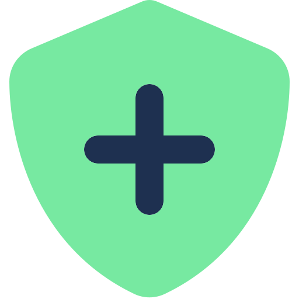

# identinet-plugin

[identinet](https://github.com/identinet/identinet-plugin) is a browser
extension that displays and verifies decentralized identity information of
websites. The extension is a [did:hack project](https://didhack.xyz/).

## Installation

- Firefox: [https://addons.mozilla.org/en-US/developers/addon/identinet]()
- Chrome: [TODO]()

## Usage

After installation, the extension is added to the list of extensions. Pin the
extension to the browser bar so that it is permanently visible.

The availability of a DID document and additional credentials for the website is
displayed with the following icons:

-  No DID document is available.
-  DID document is available, no credentials are
  available.
-  DID and credentials are available, the
  credentials have been successfully verified.
-  DID document incorrect or verification of
  credentials of failed.

Examples:

- Visit [google.com](https://www.google.com/) for a website without a DID
  document
- TODO: add page that only offers a DID document
- Visit [identinet.io](https://identinet.io/) for a website a DID and a
  verifiable presentation
- TODO: add page that offers a broken DID document / presentation

## How it Works

The extension ..

1. displays the [W3C DID Document](https://w3c.github.io/did-core/) that is
   associated with the visited website, i.e. the DID `did:web:<domainname>`
   who's document is stored at `https://<domainname>/.well-known/did.json`.
2. retrieves, verifies, and displays a publicly stored
   [W3C Verifiable Presentation](https://www.w3.org/TR/vc-data-model-1.1/#presentations-0)
   that might contain multiple credentials. It's expected that DID
   `did:web:<domainname>` issued the presentation and that it's publicly
   available at `https://<domainname>/.well-known/presentation.json`.

## Development

Requirements:

- [just](https://just.systems/) - Task runner like make
- [nu](https://nushell.sh/) - Versatile shell (developed on version 0.80.0)
- [NodeJS](https://nodejs.org/) - (developed on version 18.16.0)
- [Google Chrome](https://www.google.com/chrome/index.html) or
  [Firefox](https://www.mozilla.org/en-US/firefox/)

Steps to start development:

1. Install node modules: `just deps`
2. Build extension: `just build`
   - Firefox build directory: `.build_firefox`
   - Chrome build directory: `.build_chrome`
3. Install plugin temporarily:
   - Firefox:
     - Open [about:debugging](about:debugging#/runtime/this-firefox) and select
       "This Firefox"
     - Click on "Load Temporary Add-on..." and select `manifest.json` in the
       Firefox build directory
     - See more detailed
       [instructions](https://developer.mozilla.org/en-US/docs/Mozilla/Add-ons/WebExtensions/Your_first_WebExtension#installing)
   - Chrome:
     - Open [chrome://extensions/](chrome://extensions/)
     - Click on "Load unpacked" and select the Chrome build directory
     - See more detailed
       [instructions](https://developer.chrome.com/docs/extensions/mv3/getstarted/development-basics/#load-unpacked)
4. Start development
5. Manually reload extension by clicking reload (Firefox) or update (Chrome) to
   include changes

## Resources

- [Firefox browser extension documentation](https://developer.mozilla.org/en-US/docs/Mozilla/Add-ons/WebExtensions)
- [Chrome browser extension documentation](https://developer.chrome.com/docs/extensions/mv3/getstarted/)
- [W3C DID Core Specification](https://w3c.github.io/did-core/)
- [did:web method](https://w3c-ccg.github.io/did-method-web/)
- [W3C Verifiable Credentials / Presentations](https://www.w3.org/TR/vc-data-model-1.1/)
