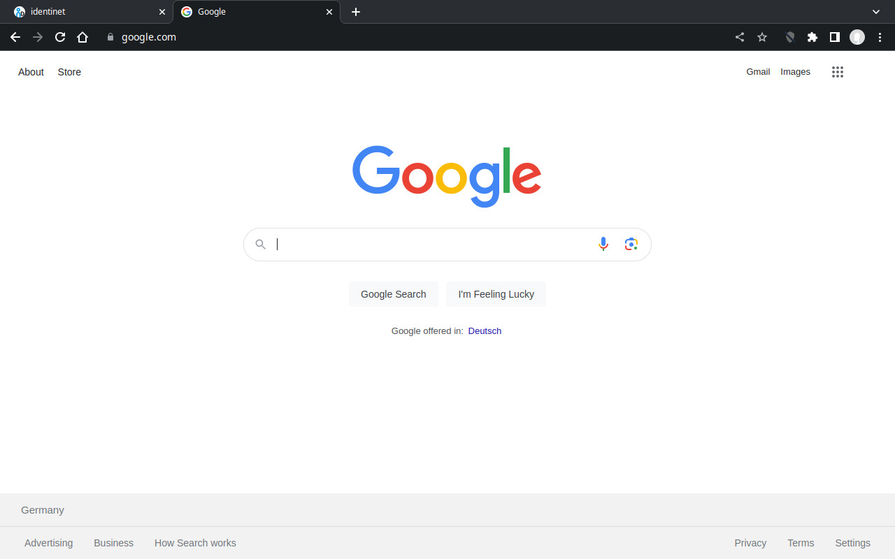
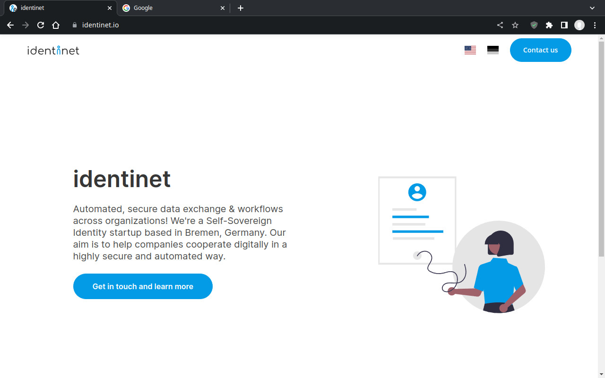
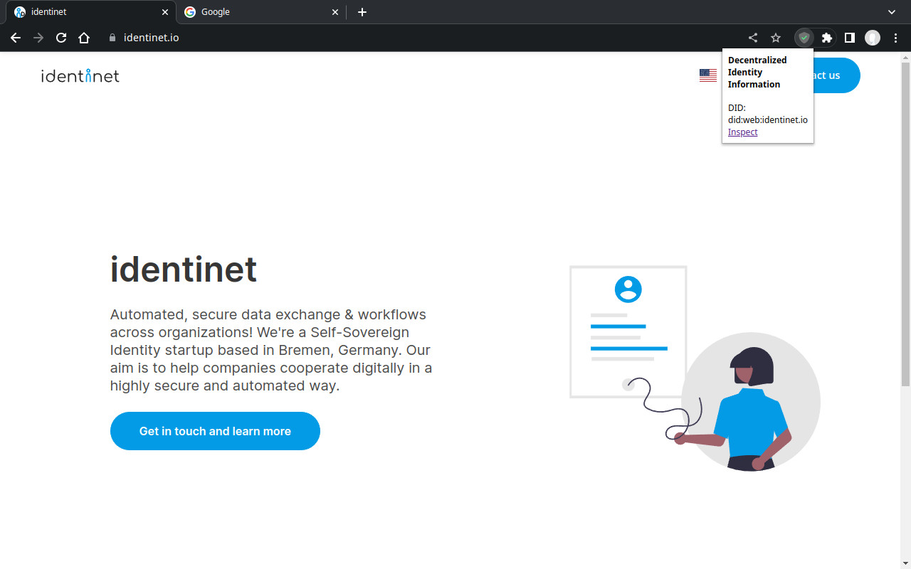

---
# Metadata about the presentation:
title: identinet-plugin
author: Jan Christoph Ebersbach
date: 2023-06-08
keywords: firefox chrome identity extension credentials ssi did

# Presentation settings:
# URL to favicon
# favicon: ./favicon.svg
favicon: https://identinet.github.io/slidesdown-theme/images/favicon.svg
# Theme, list of supported themes: https://github.com/slidesdown/slidesdown/tree/main/docs/reveal.js/dist/theme
# theme: white
theme: https://identinet.github.io/slidesdown-theme/identinet.css
# Code highlighting theme, list of supported themes: https://github.com/slidesdown/slidesdown/tree/main/docs/reveal.js/plugin/highlight
highlight-theme: tokyo-night-dark
# Load font awesome pro icons (only works on domain slidesdown.github.io) free icons work everywhere. If both are enabled the pro icons are loaded
fontawesomePro: true
fontawesomeFree: false

# Show progress bar
progress: true
# Show controls
controls: false
# Center presentation
center: true
# Create separate pages for fragments
pdfSeparateFragments: false
# Full list of supported settings: https://revealjs.com/config/ or
# https://github.com/hakimel/reveal.js/blob/master/js/config.js
---

# identinet-plugin

> A
> 
> project

## Motivation

Making Decentralized Identifiers (DIDs) and Verifiable Credentials (VCs)
accessible to everyone.

### Approach

- Simplify the usage of DIDs and VCs for widespread adoption.
  <!-- .element: class="fragment" -->
- Integrate DIDs and VCs into an everyday tool.
  <!-- .element: class="fragment" -->

## Project

- Browser extension integrating DIDs and VCs.
  <!-- .element: class="fragment" -->
- Enable website owners to publish DID documents and Verifiable Credentials.
  <!-- .element: class="fragment" -->
- Verifies and displays DID and VC data to visitors.
  <!-- .element: class="fragment" -->

### How it Works

<ol>
  <li class="fragment">Visitor <i class="fa-duotone fa-user" style="color: #039BE5"></i> enters a website
     <i class="fa-duotone fa-browser" style="color: #039BE5"></i>
  </li>
  <li class="fragment">Plugin <i class="fa-duotone fa-puzzle-piece-simple" style="color: #039BE5"></i>
     retrieves the DID document
     <i class="fa-duotone fa-fingerprint" style="color: #039BE5"></i>
  </li>
  <li class="fragment">Plugin <i class="fa-duotone fa-puzzle-piece-simple" style="color: #039BE5"></i>
     retrieves the Verifiable Presentation
     <i class="fa-duotone fa-address-card" style="color: #039BE5"></i>
  </li>
  <li class="fragment">Plugin <i class="fa-duotone fa-puzzle-piece-simple" style="color: #039BE5"></i>
     verifies the data and displays the status
     <i class="fa-duotone fa-shield-slash" style="color: #039BE5"></i>
     <i class="fa-duotone fa-shield-check" style="color: #039BE5"></i>
     <i class="fa-duotone fa-shield-plus" style="color: #039BE5"></i>
     <i class="fa-duotone fa-shield-xmark" style="color: #039BE5"></i>
  </li>
  <li class="fragment">Visitor <i class="fa-duotone fa-user" style="color: #039BE5"></i> reviews the details
     <i class="fa-duotone fa-puzzle-piece-simple" style="color: #039BE5"></i>
  </li>
</ol>

|||

|||

|||

## Status

- ✅ Source code available at
  [github.com/identinet/identinet-plugin](https://github.com/identinet/identinet-plugin).
- ✅ Functional plugin.
- ✅ Firefox Extension is published.
- 💤 Chrome Extension under review.
- ☐ Plugin fetches data too often.
- ☐ Plugin lacks a good UI.
- ☐ Verification of Credentials not yet implemented.

## Next Steps

- Improve the user interface.
- Explore potential use cases.
- Develop a web service with the same functionality as the browser extension,
  making the extension optional.

### Potential Use Cases

- Online publication of business information (e.g., VAT or bank account
  numbers).
- Enhancing website logos and claims with verifiable information (e.g., customer
  testimonials or business partnerships).

## Contact Information

Jan Christoph Ebersbach

jan-christoph.eberbach@identinet.io

## Thank You
